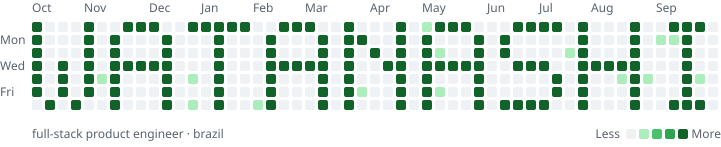

<picture>
  <source media="(prefers-color-scheme: dark)" srcset="assets/graph-dark.svg">
  
</picture>

 

hey, i'm **watanashi** — a 19 y/o full-stack developer from brazil.

i build web apps end to end with react, typescript and node.js, and still reach for php when the job calls for it. graduated in systems development; currently going deeper into next.js, docker and postgres.

open to freelance and full-time roles. the fastest way to reach me is [instagram](https://instagram.com/tanash1zada).

 

<picture>
  <source media="(prefers-color-scheme: dark)" srcset="https://skillicons.dev/icons?i=react,ts,js,nodejs,php,tailwind,nextjs,docker,postgres,git&theme=dark">
  
</picture>

  

the graph above is drawn, not earned. <a href="scripts/name-graph.mjs">here's how.</a>
