<!--
  ⚠️  This file is generated by scripts/build.mjs — edits here are overwritten daily.
      To change text, links, stack or plans, edit profile.config.json.
-->

  &nbsp;
  

 

  &nbsp;
  &nbsp;
  

<h2 align="center">Changelog</h2>

Latest releases, pulled from my public repositories on every build.

> ⏳ Syncing with GitHub… the changelog appears after the first workflow run.

 

