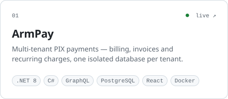
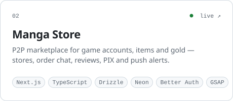

<picture>
  <source media="(prefers-color-scheme: dark)" srcset="assets/graph-dark.svg">
  
</picture>

 

### hey, i'm watanashi.

i'm a 22 y/o **full-stack product engineer** from brazil, and i ship production software end to end — from the database schema to the last pixel of the interface.

lately that means **payments and marketplaces**: a multi-tenant pix platform in .net, a p2p marketplace in next.js, and the admin dashboards people use to run them every day.

- **full ownership** — schema, api, ui, deploy. you don't need three people to get one feature out.
- **product sense** — i build for the metric that matters, not just for what's written in the ticket.
- **interfaces that feel expensive** — designed in figma, built with motion, typography and details done properly (gsap and three.js when it earns its place).
- **ai-native engineering** and more..

open to **freelance projects** and **full-time remote roles**.

 

### selected work

<a href="https://armpay.vercel.app"><picture><source media="(prefers-color-scheme: dark)" srcset="assets/work-armpay-dark.svg"></picture></a>&nbsp;
<a href="https://marketmanga.vercel.app"><picture><source media="(prefers-color-scheme: dark)" srcset="assets/work-mangastore-dark.svg"></picture></a>

most of my work lives in 35+ private repositories — payments, marketplaces, bots and auth systems. happy to walk you through the code on a call.

 

### stack

`languages` 
<picture>
  <source media="(prefers-color-scheme: dark)" srcset="https://skillicons.dev/icons?i=ts%2Cjs%2Ccs%2Cpy%2Cphp%2Chtml%2Ccss&theme=dark">
  
</picture>

`frontend & design` 
<picture>
  <source media="(prefers-color-scheme: dark)" srcset="https://skillicons.dev/icons?i=react%2Cnextjs%2Ctailwind%2Cthreejs%2Cvite%2Cfigma&theme=dark">
  
</picture>

`backend & data` 
<picture>
  <source media="(prefers-color-scheme: dark)" srcset="https://skillicons.dev/icons?i=nodejs%2Cdotnet%2Cgraphql%2Cpostgres%2Cmongodb%2Cprisma%2Cmysql&theme=dark">
  
</picture>

`infra & tools` 
<picture>
  <source media="(prefers-color-scheme: dark)" srcset="https://skillicons.dev/icons?i=docker%2Cvercel%2Cgit%2Cgithub%2Cvscode&theme=dark">
  
</picture>

 

### get in touch

[instagram](https://instagram.com/tanash1zada) &nbsp;·&nbsp; [github](https://github.com/tanashic0dex)

 

the graph at the top is drawn, not earned — <a href="scripts/name-graph.mjs">here's how</a>.
