<!--
  Generated by scripts/build.mjs — edits here are overwritten.
  Change text, links, stack or services in profile.config.json.
-->

<a name="overview"></a>
<picture><source media="(prefers-color-scheme: dark)" srcset="assets/overview-dark.svg"/></picture>

<p align="center">
  <a href="#overview"><picture><source media="(prefers-color-scheme: dark)" srcset="assets/tab-overview-dark.svg"/></picture></a>&nbsp;
  <a href="#projects"><picture><source media="(prefers-color-scheme: dark)" srcset="assets/tab-projects-dark.svg"/></picture></a>&nbsp;
  <a href="#stack"><picture><source media="(prefers-color-scheme: dark)" srcset="assets/tab-stack-dark.svg"/></picture></a>&nbsp;
  <a href="#services"><picture><source media="(prefers-color-scheme: dark)" srcset="assets/tab-services-dark.svg"/></picture></a>&nbsp;
  <a href="#contact"><picture><source media="(prefers-color-scheme: dark)" srcset="assets/tab-contact-dark.svg"/></picture></a>
</p>

<details>
<summary><b>About me</b> <sub>· expand</sub></summary>
<br/>

```ts
const watanashi = {
  role: "Full-stack developer",
  location: "Brazil · UTC−3 (BRT)",
  education: "Systems Development",
  stack: ["React", "TypeScript", "JavaScript", "Node.js", "PHP", "CSS / Tailwind", "Git"],
  learning: ["Next.js", "Docker", "PostgreSQL"],
  status: "Open to work",
} as const;
```

</details>

<a name="projects"></a>
<details open>
<summary><b>Projects</b> <sub>· public repositories</sub></summary>
<br/>

Browse everything I've published on [my repositories page](https://github.com/tanashic0dex?tab=repositories).

</details>

<a name="stack"></a>
<picture><source media="(prefers-color-scheme: dark)" srcset="assets/stack-dark.svg"/></picture>

<a name="services"></a>
<picture><source media="(prefers-color-scheme: dark)" srcset="assets/services-dark.svg"/></picture>

<p align="center">
  <a href="https://github.com/tanashic0dex?tab=repositories"><picture><source media="(prefers-color-scheme: dark)" srcset="assets/btn-repos-dark.svg"/></picture></a>&nbsp;
  <a href="https://github.com/tanashic0dex"><picture><source media="(prefers-color-scheme: dark)" srcset="assets/btn-start-dark.svg"/></picture></a>&nbsp;
  <a href="https://github.com/tanashic0dex"><picture><source media="(prefers-color-scheme: dark)" srcset="assets/btn-call-dark.svg"/></picture></a>
</p>

<a name="contact"></a>
<p align="center">
  <a href="https://instagram.com/tanash1zada"><picture><source media="(prefers-color-scheme: dark)" srcset="assets/btn-instagram-dark.svg"/></picture></a>&nbsp;
  <a href="https://github.com/tanashic0dex"><picture><source media="(prefers-color-scheme: dark)" srcset="assets/btn-github-dark.svg"/></picture></a>
</p>

<p align="center"><sub>Watanashi · Brazil · generated by <a href="scripts/build.mjs">scripts/build.mjs</a></sub></p>
